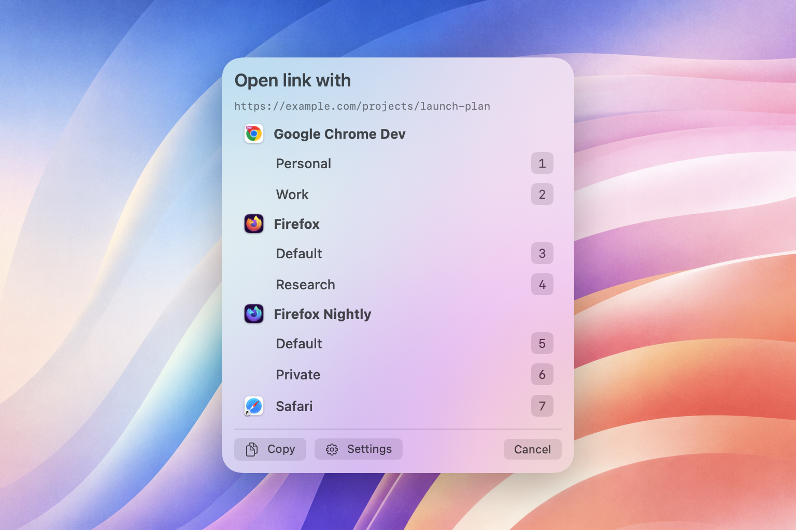
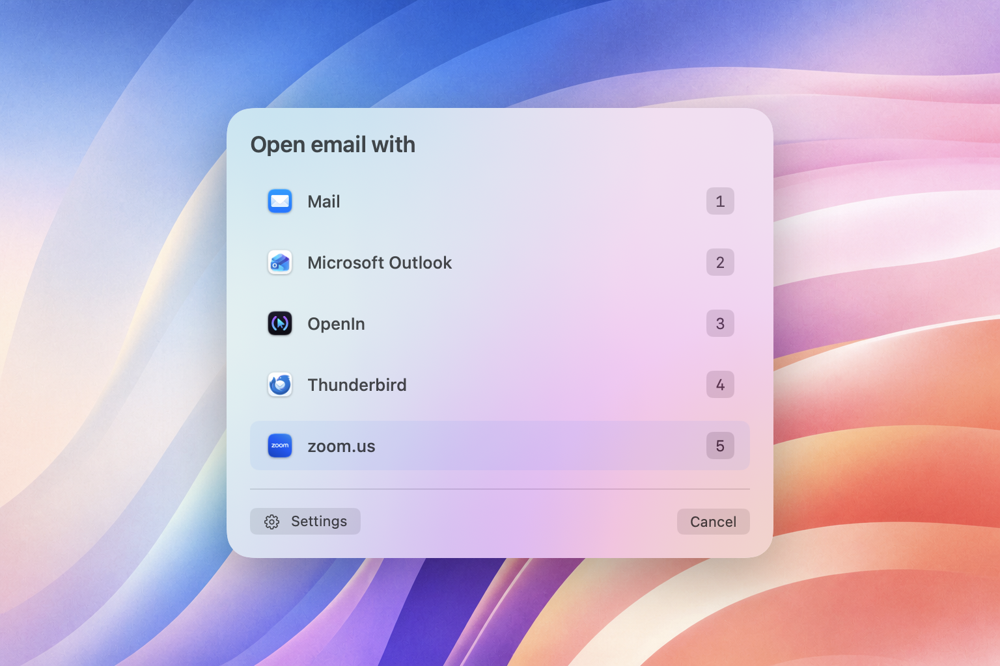
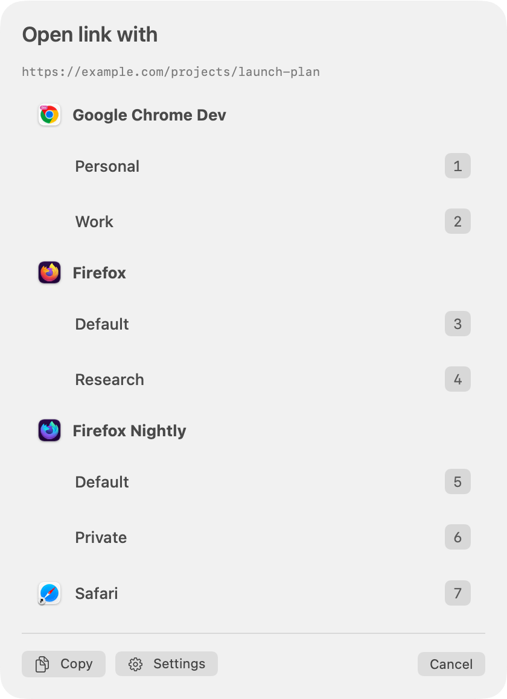
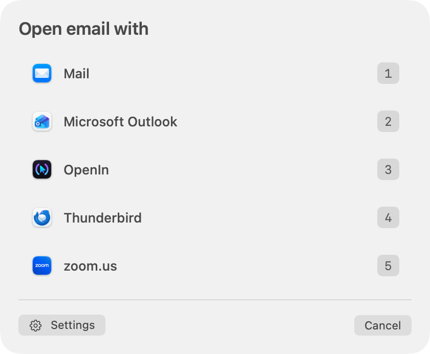
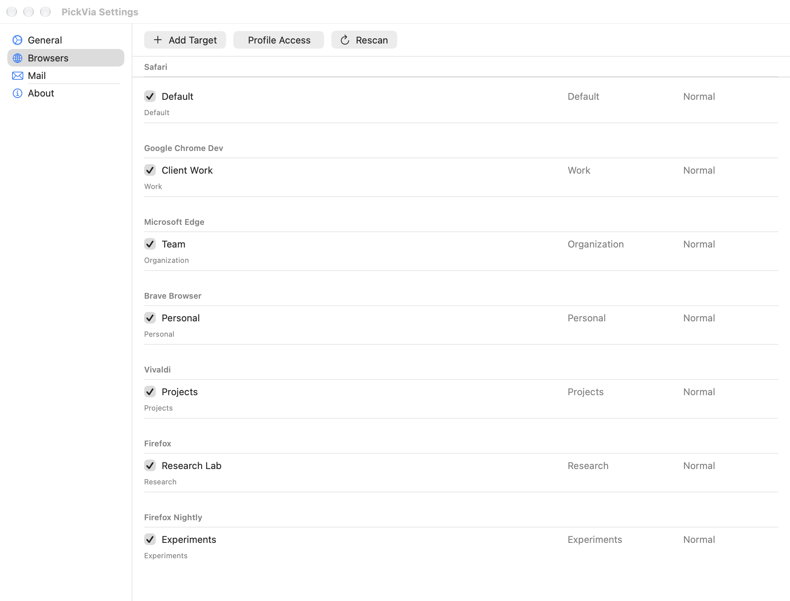

# PickVia

<p align="center">
  
</p>

<p align="center"><strong>Choose where every link opens.</strong></p>

PickVia is a fast, local menu-bar app for macOS. Choose the exact browser,
profile, or mail application you want whenever you open a web or email link.

**[Visit the PickVia website](https://kiteretsu903.github.io/pick-via/)** for
screenshots, release highlights, and the [changelog](https://kiteretsu903.github.io/pick-via/changelog.html).

<p align="center">
  
</p>

<p align="center"><sub>Pick the right browser and profile without breaking your flow.</sub></p>

## Download

**[Download PickVia v1.2 for macOS](https://github.com/kiteretsu903/pick-via/releases/latest)**

PickVia requires **macOS 14 Sonoma or later** on **Apple Silicon**.
PickVia handles HTTP, HTTPS, and `mailto:` links.

## What it does

- **Choose at the moment it matters.** Every web link opens a focused chooser
  beside your pointer instead of silently taking over an existing browser.
- **Use the browser and profile you mean.** Pick Safari, Chrome, Chrome Beta,
  Chromium, Edge, Brave, Vivaldi, or Firefox; supported browsers can expose
  their normal, private, and discovered profile targets.
- **Choose your mail application.** PickVia discovers applications registered
  for `mailto:` links and presents direct app-level choices without exposing
  recipients, subjects, or message bodies in the chooser.
- **Stay out of the way.** PickVia lives in the menu bar and has no Dock icon.
- **Keep link handling local.** PickVia does not send, log, or persist opened
  URLs. Its configuration stays in your Application Support folder.
- **Keep profile access deliberate.** If macOS protects a browser's profile
  folder, PickVia asks only for that browser's exact data root. You can remove
  the grant at any time in Browser Settings.

## Native, focused, and fast

PickVia uses a compact native macOS chooser with real translucent material,
keyboard shortcuts, and the application icons already installed on your Mac.
Browser and email links share the same focused interaction without exposing the
contents of the link.

<p align="center">
  
</p>

### The choosers on their own

<table>
  <tr>
    <td align="center" valign="top" width="50%">
      
      <br><sub>Browser profiles and private targets</sub>
    </td>
    <td align="center" valign="top" width="50%">
      
      <br><sub>Installed email applications</sub>
    </td>
  </tr>
</table>

## Configure once

Enable only the browsers, profiles, private modes, and mail applications you
want to see. Reorder targets so your everyday choices get the fastest keyboard
shortcuts.

<p align="center">
  
</p>

## Install

1. Download and open `PickVia-v1.2.dmg` from the
   [GitHub release](https://github.com/kiteretsu903/pick-via/releases/latest).
2. Drag **PickVia** to the **Applications** folder shown in the installer.
3. Open **PickVia** from Applications and follow the welcome flow.
4. Choose **Set as Default**. macOS asks separately for permission to handle
   HTTP and HTTPS links.
5. Optionally review your installed mail applications and make PickVia the
   default handler for `mailto:` links, or choose **Skip Mail Setup**.

### First launch and Gatekeeper

PickVia v1.2 is ad-hoc signed and not notarized. macOS will block the first
launch of the downloaded app. If you have downloaded it from this GitHub
release and choose to trust it:

1. Try to open PickVia once and dismiss the warning.
2. Open **System Settings → Privacy & Security** and scroll to **Security**.
3. Click **Open Anyway**, then confirm **Open**. The button is available for
   about one hour after the blocked launch attempt.

**If macOS still blocks the app:** make sure **PickVia.app** is in
Applications, try to open it once and dismiss the warning, then follow the
steps above. If **Open Anyway** still does not appear, run:

```zsh
xattr -dr com.apple.quarantine "/Applications/PickVia.app"
```

Apple documents this Gatekeeper override and its security implications in
[Safely open apps on your Mac](https://support.apple.com/en-asia/102445).

## Browser support

| Browser family | Profiles | Normal | Private |
|---|---:|---:|---:|
| Safari | No | Yes | No |
| Chrome, Chrome Beta, Chromium, Edge, Brave, Vivaldi | Yes | Yes | Yes |
| Firefox | Yes | Yes | Yes |

Safari has one normal-window target. Chromium-family browsers and Firefox keep
a browser-level Default target even if you choose not to grant profile access;
granting access adds discovered profiles.

## Mail support

PickVia handles `mailto:` links only. It automatically discovers installed
applications that macOS registers for email links and presents app-level
choices—never mail accounts, profiles, identities, or compose modes.

Use **Mail Settings** to enable or disable applications, change their order,
and rescan registered handlers. Mail setup is optional during onboarding;
choose **Skip Mail Setup** to keep your current default mail handler and
configure PickVia later.

## Privacy

PickVia stores browser target configuration in
`~/Library/Application Support/PickVia/PickViaConfig.json`. It does not persist
the links you open. When you grant profile access, the app stores only a
read-only security-scoped bookmark for the browser data root; it does not read
browsing history, cookies, sessions, saved passwords, or page content.

The mail chooser does not preview, rewrite, log, or persist recipients,
subjects, message bodies, or the original `mailto:` request.

To remove a profile-access grant, open **Browser Settings → Profile Access**
and choose **Remove Access** for that browser.

## License

MIT. See [LICENSE](LICENSE).
